# Agent Development Kit (ADK) Lab Instruction

The Agent Development Kit (ADK) helps you create agents and tools for watsonx Orchestrate. This lab will guide you through how to use the ADK to setup your IBM watsonx Orchestrate Agent Builder, create an agent, add tools and other agents to collaborate with your agent on accomplishing tasks.

## Section 0: Before You Begin

Before you start to follow this tutorial, you must set up your IBM watsonx Orchestrate ADK environment, where you build agents and tools. It also provides a convenient interface for managing credentials, sending requests, and handling responses from the service's APIs.

## Installation Prerequisites

Install the required software to enable the ADK installation:

**Python**: The programming language that the ADK is written in. The ADK requires at least Python 3.11, and the latest compatible version is Python 3.13. For more information, see [**Python**](https://www.python.org/downloads/).

**Pip**: Pip is Python's package manager. In some operating systems, it's included with Python's installation. For more information, see [**Pip**](https://pip.pypa.io/en/stable/installation/).

**Optional**: Create and activate a virtual environment with venv to install the ADK. For more information, see [**venv --- Creation of virtual environments**](https://docs.python.org/3/library/venv.html).

## Installing the ADK

On your local computer open your terminal/Command prompt and run the following commands:

1. Install the ADK with pip:

```bash
pip install ibm-watsonx-orchestrate
```

2. Test the installation:

```bash
orchestrate --version
```

After installation, you can start using the ADK and its CLI. For more information on available commands and arguments, use the `--help` argument at the end of a command. For example: `orchestrate --help`.

## Connect to Remote Environment

In order to publish and deploy your agents and tools in this lab you need to connect to your watsonx Orchestrate environment. To do that you will need two credentials: your instance URL and your IBM cloud API key:

### Create and Download Your API Key

1. Go to your IBM cloud account → <https://cloud.ibm.com/resources>

2. Make sure you are in the right account which has been reserved for you and not your personal account.

3. Under Manage select Access (IAM)

   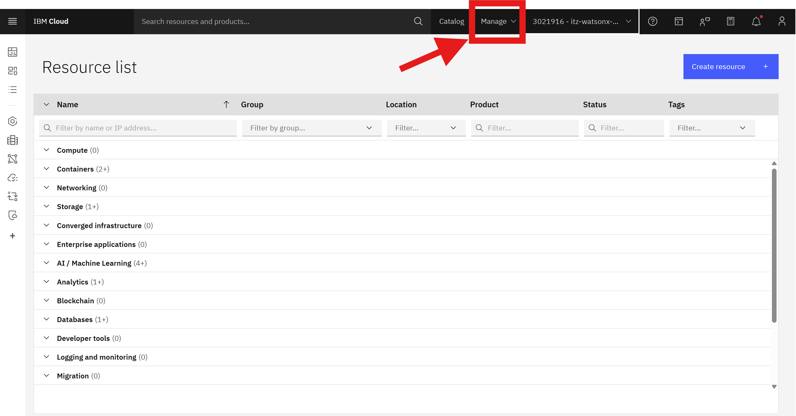

4. Go to API keys on the left

   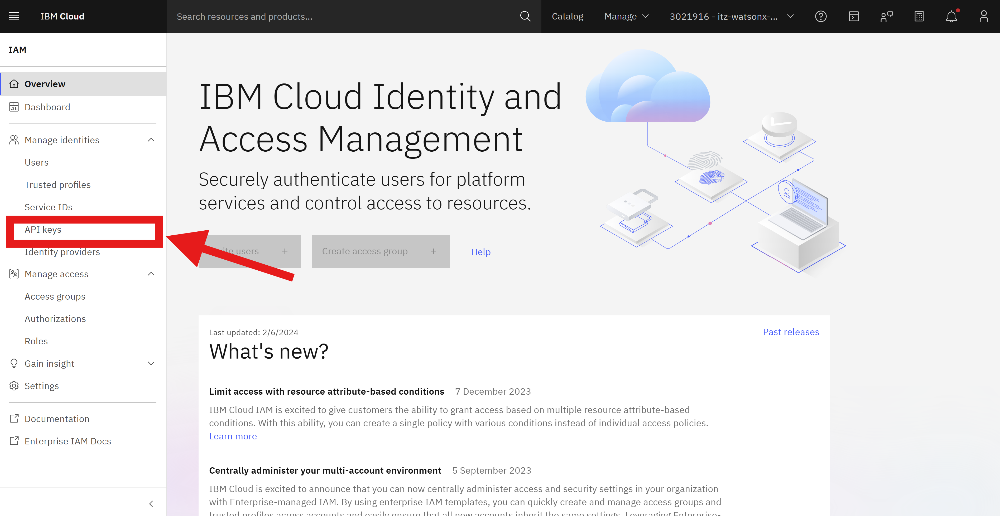

5. Create a new API

   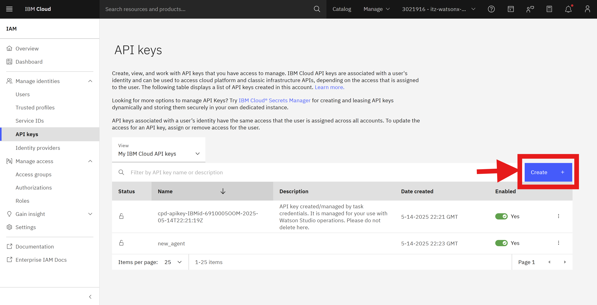

6. Give it a name and click on create:

   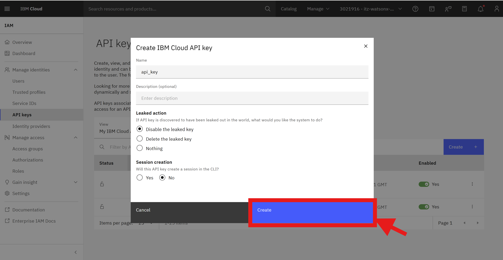

7. Make sure to copy and save your API key in a text file. You can also download it as a JSON file.

### Copy the watsonx Orchestrate Instance URL

1. Go to your IBM cloud account → <https://cloud.ibm.com/resources>

2. Make sure you are in the right account which has been reserved for you and not your personal account.

3. Under Resources and under AI/Machine Learning, click on the Watson Orchestrate instance:

   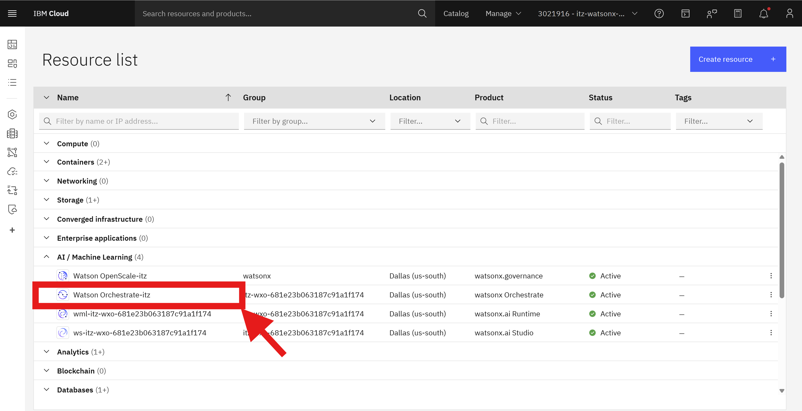

4. Click on Launch watsonx Orchestrate:

   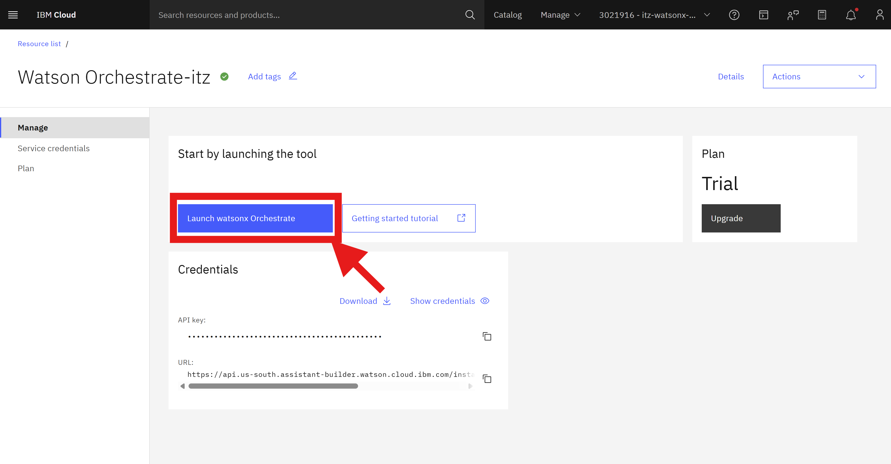

5. Click on your profile on the top right

   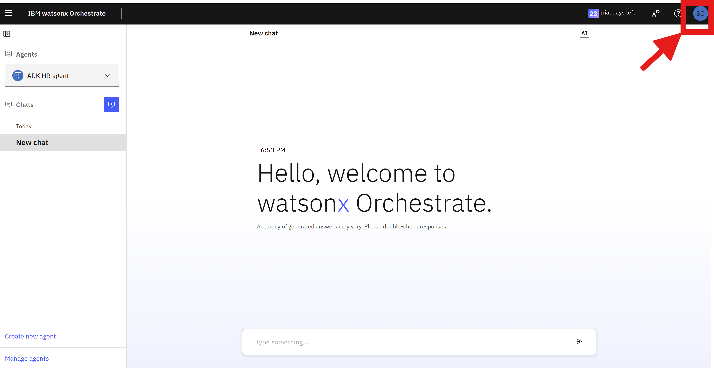

6. Go to settings

   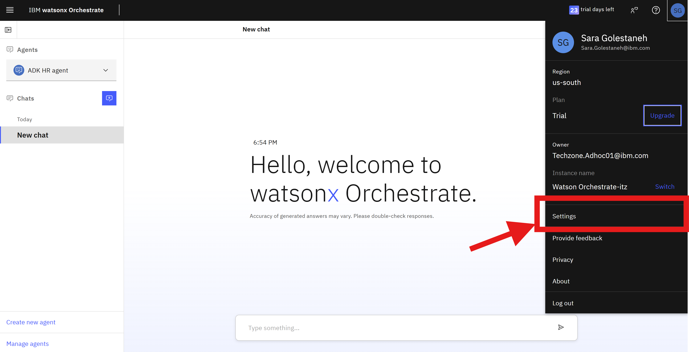

7. Go to API details tab

   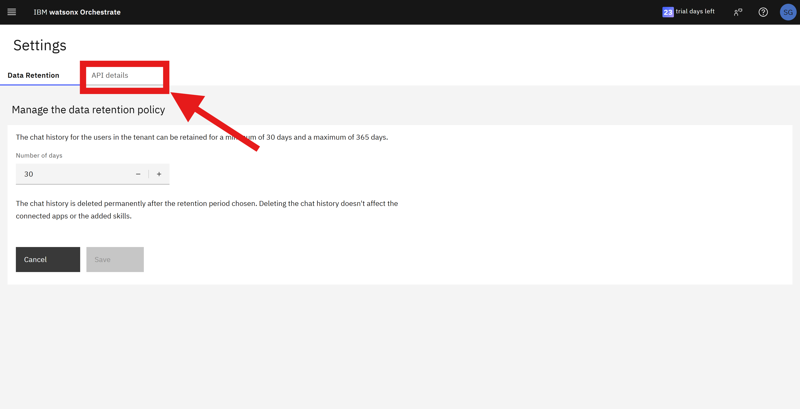

8. Copy and save the Instance URL in a text file to use it later.

   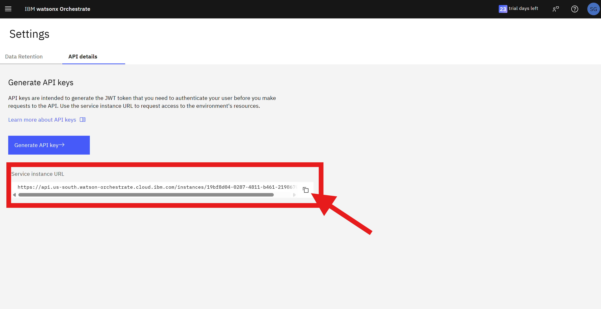

### Configure the Environment

9. Now that you have both the API key and the instance URL, go back to your terminal window on your local computer again and run the following commands. Make sure to replace the `API_KEY` and the `ORCHESTRATE_INSTANCE_URL` with your own values that you copied earlier.

```bash
orchestrate env add -n agentic-bootcamp -u ORCHESTRATE_INSTANCE_URL -i https://iam.cloud.ibm.com
```

```bash
orchestrate env activate agentic-bootcamp --apikey API_KEY
```

10. To make sure the orchestrate environment has been successfully created and activated you can run `orchestrate env list` and you should see something similar to the below image:

    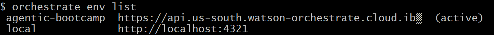

Great! You are now connected to your watsonx Orchestrate environment from your local computer and you are all set up to use the ADK to create your agents.

---

# Empower: An Agent for Employee Success

This lab is based on a scenario called **Empower: An agent for employee success**. The goal is to create an agent with a key role in assisting employees by answering their questions, providing guidance on supporting tickets, service issues, and referencing FAQs stored in SharePoint. The following sections walk you through the complete agent building process, from defining the name and description until the deployment process and the agent's usage on watsonx Orchestrate chat.

## ServiceNow and Customer Care Examples

After setting up the ADK and starting your local orchestrate server, you need to import the ServiceNow and Customer care examples, both agent and tools, once they are used to create the Empower agent. The following sections make available the files that are needed to build the ServiceNow and Customer care examples, and how to install them.

## Setup Options

You can set up the lab environment using one of the following two options. If you are using Option 1 (if you have been provided the `adk_lab.zip` file from the instructor), you can skip Section 1, 2 and 3 and go directly to **Section 4: Installing ServiceNow and Customer care**.

### Option 1 (Skip Manual Setup and go to Section 4): Download and Extract the Provided Zip File

**Download and extract** the provided `adk_lab.zip` file. All necessary files and folder structures are already set up for you, so you can skip **Option 2: Section 1 to 3**, which involve manually creating the agents and tools.

### Option 2 (Manual Setup – Section 1 to 3): Create a Directory

Create a folder for this lab. You'll be creating all the files and subfolders from the following sections under this root directory. You can name it `adk_lab`:

```bash
mkdir adk_lab
cd adk_lab
```

## Section 1: Customer Care and ServiceNow Agents

The following section guides you to create the Customer care and ServiceNow agents.

1. Create a folder to structure your agents and tools. For instance, name this folder as **agents**.

2. In the new folder, create a YAML file with a text editor of your preference. Name the file as **customer_care_agent**.

3. Insert the following code into the `customer_care_agent.yaml` file:

```yaml
spec_version: v1
style: react
name: customer_care_agent
llm: watsonx/meta-llama/llama-3-2-90b-vision-instruct
description: >
  You are an agent who specializes in customer care for a large healthcare institution. You should be compassionate
  to the user.
  
  You are able to answer questions around benefits provided by different plans, the status of a claim,
  and are able to help direct people to the nearest provider for a particular ailment.

instructions: >
  Use the search_healthcare_providers tool to search for providers. If more than 1 is returned format as a github
  formatted markdown table. Otherwise simply return the output in a kind conversational tone. Do not expand speciality acronyms.
  
  Use the get_healthcare_benefits tool to fetch the benefits coverage for a particular ailment, or for generic plan
  comparisons. Respond to get_healthcare_benefits requests in a github style formatted markdown table. Be specific about
  the expected coverage type if a particular condition is mentioned.
  
  Use the get_my_claims tool to fetch your open medical claims. Make sure to respond in a direct tone and
  do not negotiate prices. Format the output of get_my_claims as a github style markdown table.

collaborators:
  - service_now_agent

tools:
  - search_healthcare_providers
  - get_healthcare_benefits
  - get_my_claims
```

4. Save your file.

5. Create another YAML file, but name it as `service_now_agent`.

6. Insert the following code into the `service_now_agent.yaml` file:

```yaml
spec_version: v1
style: react
name: service_now_agent
llm: watsonx/meta-llama/llama-3-2-90b-vision-instruct
description: >
  You are an agent who specializes in customer care for a large healthcare institution. You should be compassionate
  to the user.
  
  You are able to help help a user create tickets in service now for processing by a human later. Examples of when to do
  do this include for adding members to plans or helping users with documentation.

instructions: >
  If a user is having difficulty either generating benefits documents or adding additional members to their plan,
  create a new incident for our support team using service_now_create_incident tool. Be compassionate about the user
  facing difficulty.
  
  The output of get_service_now_incidents should be formatted as a github style formatted markdown table.

collaborators: []

tools:
  - create_service_now_incident
  - get_my_service_now_incidents
  - get_service_now_incident_by_number
```

7. Save your file.

Up until here, you created the agents that are needed for Customer care and ServiceNow examples.

## Section 2: Creating the Customer Care Tools

The following section guides you to create the tools for Customer care example.

1. Create a new folder to insert the tools of your examples. For instance, name this folder as **tools**.

2. In the new folder, create another one to insert the customer care tools. Name this folder as **customer_care**.

3. In the `customer_care` folder, create a Python file with a text editor of your preference. Name the file as `get_healthcare_benefits`.

4. Insert the following code into the `get_healthcare_benefits.py` file:

```python
from enum import Enum
from ibm_watsonx_orchestrate.agent_builder.tools import tool, ToolPermission
import requests

class Plan(str, Enum):
    HDHP = 'HDHP'
    HDHP_Plus = 'HDHP Plus'
    PPO = 'PPO'

@tool
def get_healthcare_benefits(plan: Plan, in_network: bool = None):
    """
    Retrieve a comprehensive list of health benefits data, organized by coverage type and plan variant.
    This data outlines details such as annual deductibles, out-of-pocket maximums, and various co-pays
    or percentages for medical services under different network plans (HDHP, HDHP Plus, and PPO).

    :param plan: Which plan the user is currently on, can be one of "HDHP", "HDHP Plus", or "PPO". If not provided all plans will be returned.
    :param in_network: Whether the user wants coverage for in network or out of network. If not provided both will be returned.
    :returns: A list of dictionaries, where each dictionary contains:
            - 'Coverage': A description of the coverage type (e.g., 'Preventive Services')
            - 'HDHP (In-Network)': The cost/percentage coverage for an in-network HDHP plan
            - 'HDHP (Out-of-Network)': The cost/percentage coverage for an out-of-network HDHP plan
            - 'HDHP Plus (In-Network)': The cost/percentage coverage for an in-network HDHP Plus plan
            - 'HDHP Plus (Out-of-Network)': The cost/percentage coverage for an out-of-network HDHP Plus plan
            - 'PPO (In-Network)': The cost/percentage coverage for an in-network PPO plan
            - 'PPO (Out-of-Network)': The cost/percentage coverage for an out-of-network PPO plan
    """
    resp = requests.get(
        'https://get-benefits-data.1sqnxi8zv3dh.us-east.codeengine.appdomain.cloud/',
        params={
            'plan': plan,
            'in_network': in_network
        }
    )
    resp.raise_for_status()
    return resp.json()['benefits']
```

5. Save your file.

6. In the same folder, create another Python file and name it as `get_my_claims`.

7. Insert the following code into the `get_my_claims.py` file:

```python
from ibm_watsonx_orchestrate.agent_builder.tools import tool

@tool
def get_my_claims():
    """
    Retrieve detailed information about submitted claims including claim status, submission and processing dates,
    amounts claimed and approved, provider information, and services included in the claims.

    :returns: A list of dictionaries, each containing details about a specific claim:
            - 'claimId': Unique identifier for the claim
            - 'submittedDate': Date when the claim was submitted
            - 'claimStatus': Current status of the claim (e.g., 'Processed', 'Pending', 'Rejected')
            - 'processedDate': Date when the claim was processed (null if not processed yet)
            - 'amountClaimed': Total amount claimed
            - 'amountApproved': Amount approved for reimbursement (null if pending, 0 if rejected)
            - 'rejectionReason': Reason for rejection if applicable (only present if claimStatus is 'Rejected')
            - 'provider': Provider details, either as a simple string or a dictionary with detailed provider information
            - 'services': List of services included in the claim, each with:
                - 'serviceId': Identifier for the service
                - 'description': Description of the service provided
                - 'dateOfService': Date the service was provided
                - 'amount': Amount charged for the service
    """
    claims_data = [
        {
            "claimId": "CLM1234567",
            "claimStatus": "Processed",
            "amountClaimed": 150.00,
            "amountApproved": 120.00,
            "provider": {
                "name": "Healthcare Clinic ABC",
                "providerId": "PRV001234",
                "providerType": "Clinic"
            },
            "services": [
                {"serviceId": "SVC001", "description": "General Consultation", "dateOfService": "2025-02-28", "amount": 100.00},
                {"serviceId": "SVC002", "description": "Blood Test", "dateOfService": "2025-02-28", "amount": 50.00}
            ]
        },
        {
            "claimId": "CLM7654321",
            "claimStatus": "Pending",
            "amountClaimed": 300.00,
            "amountApproved": None,
            "provider": "City Health Hospital",
            "services": [
                {"serviceId": "SVC003", "description": "X-ray Imaging", "dateOfService": "2025-02-14", "amount": 300.00}
            ]
        },
        {
            "claimId": "CLM9876543",
            "claimStatus": "Rejected",
            "amountClaimed": 200.00,
            "amountApproved": 0.00,
            "rejectionReason": "Service not covered by policy",
            "provider": "Downtown Diagnostics",
            "services": [
                {"serviceId": "SVC003", "description": "MRI Scan", "dateOfService": "2025-02-05", "amount": 200.00}
            ]
        }
    ]
    return claims_data
```

8. Save your file.

9. In the same folder, create another Python file and name it as `search_healthcare_providers`.

10. Insert the following code into the `search_healthcare_providers.py` file:

```python
from typing import List
import requests
from pydantic import BaseModel, Field
from enum import Enum
from ibm_watsonx_orchestrate.agent_builder.tools import tool, ToolPermission

class ContactInformation(BaseModel):
    phone: str
    email: str

class HealthcareSpeciality(str, Enum):
    GENERAL_MEDICINE = 'General Medicine'
    CARDIOLOGY = 'Cardiology'
    PEDIATRICS = 'Pediatrics'
    ORTHOPEDICS = 'Orthopedics'
    ENT = 'Ear, Nose and Throat'
    MULTI_SPECIALTY = 'Multi-specialty'

class HealthcareProvider(BaseModel):
    provider_id: str = Field(None, description="The unique identifier of the provider")
    name: str = Field(None, description="The providers name")
    provider_type: str = Field(None, description="Type of provider, (e.g. Hospital, Clinic, Individual Practitioner)")
    specialty: HealthcareSpeciality = Field(None, description="Medical speciality, if applicable")
    address: str = Field(None, description="The address of the provider")
    contact: ContactInformation = Field(None, description="The contact information of the provider")

@tool
def search_healthcare_providers(
        location: str,
        specialty: HealthcareSpeciality = HealthcareSpeciality.GENERAL_MEDICINE
) -> List[HealthcareProvider]:
    """
    Retrieve a list of the nearest healthcare providers based on location and optional specialty. Infer the
    speciality of the location from the request.

    :param location: Geographic location to search providers in (city, state, zip code, etc.)
    :param specialty: (Optional) Medical specialty to filter providers by (Must be one of: "ENT", "General Medicine", "Cardiology", "Pediatrics", "Orthopedics", "Multi-specialty")
    :returns: A list of healthcare providers near a particular location for a given speciality
    """
    resp = requests.get(
        'https://find-provider.1sqnxi8zv3dh.us-east.codeengine.appdomain.cloud',
        params={
            'location': location,
            'speciality': specialty
        }
    )
    resp.raise_for_status()
    return resp.json()['providers']
```

Up until here you created the tools for the customer care example.

## Section 3: Creating the ServiceNow Tools

The following section guides you to create the tools for ServiceNow example.

1. In the **tools** folder, create a new folder named as **servicenow**.

2. In the **servicenow** folder, create a Python file and name it as `create_service_now_incident`.

3. Insert the following code into the `create_service_now_incident.py` file:

```python
import base64
import json
from typing import Optional
import requests
from requests.auth import HTTPBasicAuth
from pydantic import Field, BaseModel
from ibm_watsonx_orchestrate.agent_builder.tools import tool, ToolPermission
from ibm_watsonx_orchestrate.run import connections
from ibm_watsonx_orchestrate.agent_builder.connections import ConnectionType

CONNECTION_SNOW = 'service-now'

class ServiceNowIncidentResponse(BaseModel):
    """
    Represents the response received after creating a ServiceNow incident.
    """
    incident_number: str = Field(..., description='The incident number assigned by ServiceNow')
    sys_id: str = Field(..., description='The system ID of the created incident')

class ServiceNowIncident(BaseModel):
    """
    Represents the details of a ServiceNow incident.
    """
    incident_number: str = Field(..., description='The incident number assigned by ServiceNow')
    short_description: str = Field(..., description='A brief summary of the incident')
    description: Optional[str] = Field(None, description='Detailed information about the incident')
    state: str = Field(..., description='Current state of the incident')
    urgency: str = Field(..., description='Urgency level of the incident')
    created_on: str = Field(..., description='The date and time the incident was created')

@tool(
    permission=ToolPermission.READ_WRITE,
    expected_credentials=[
        {"app_id": CONNECTION_SNOW, "type": ConnectionType.BASIC_AUTH}
    ]
)
def create_service_now_incident(
        short_description: str,
        description: Optional[str] = None,
        urgency: Optional[int] = 3
):
    """
    Create a new ServiceNow incident.

    :param short_description: A brief summary of the incident.
    :param description: Detailed information about the incident (optional).
    :param urgency: Urgency level (1 - High, 2 - Medium, 3 - Low, default is 3).
    :returns: The created incident details including incident number and system ID.
    """
    creds = connections.basic_auth(CONNECTION_SNOW)
    base_url = creds.url
    url = f"{base_url}/api/now/table/incident"

    headers = {
        'Content-Type': 'application/json',
        'Accept': 'application/json'
    }

    payload = {
        'short_description': short_description,
        'description': description,
        'urgency': urgency
    }

    response = requests.post(
        url,
        headers=headers,
        json=payload,
        auth=HTTPBasicAuth(creds.username, creds.password)
    )
    response.raise_for_status()

    data = response.json()['result']
    number, sys_id = data['number'], data['sys_id']

    url = f"{base_url}/api/now/table/incident/{sys_id}"
    response = requests.get(
        url,
        headers=headers,
        json=payload,
        auth=HTTPBasicAuth(creds.username, creds.password)
    )
    response.raise_for_status()

    data = response.json()['result']

    return ServiceNowIncident(
        incident_number=data['number'],
        sys_id=data['sys_id'],
        short_description=data['short_description'],
        description=data.get('description', ''),
        state=data['state'],
        urgency=data['urgency'],
        created_on=data['opened_at']
    ).model_dump_json()
```

4. Save your file.

5. In the same folder, create another Python file and name it as `get_my_service_now_incidents`.

6. Insert the following code into the `get_my_service_now_incidents.py` file:

```python
import json
from typing import Optional, List
import requests
from pydantic import Field, BaseModel
import base64
from requests.auth import HTTPBasicAuth
from ibm_watsonx_orchestrate.agent_builder.tools import tool, ToolPermission
from ibm_watsonx_orchestrate.run import connections
from ibm_watsonx_orchestrate.agent_builder.connections import ConnectionType

CONNECTION_SNOW = 'service-now'

class ServiceNowIncident(BaseModel):
    """
    Represents the details of a ServiceNow incident.
    """
    incident_number: str = Field(..., description='The incident number assigned by ServiceNow')
    short_description: str = Field(..., description='A brief summary of the incident')
    description: Optional[str] = Field(None, description='Detailed information about the incident')
    state: str = Field(..., description='Current state of the incident')
    urgency: str = Field(..., description='Urgency level of the incident')
    created_on: str = Field(..., description='The date and time the incident was created')

@tool(
    expected_credentials=[
        {"app_id": CONNECTION_SNOW, "type": ConnectionType.BASIC_AUTH}
    ]
)
def get_my_service_now_incidents() -> List[ServiceNowIncident]:
    """
    Fetch all ServiceNow that the user was the author of.

    :returns: The incident details including number, system ID, description, state, and urgency.
    """
    creds = connections.basic_auth('service-now')
    base_url = creds.url
    url = f"{base_url}/api/now/table/incident"

    headers = {
        'Content-Type': 'application/json',
        'Accept': 'application/json'
    }
    
    query_params = {}
    query_params['sys_created_by'] = 'admin'
    
    response = requests.get(
        url,
        headers=headers,
        params=query_params,
        auth=HTTPBasicAuth(creds.username, creds.password)
    )
    response.raise_for_status()

    data = response.json()['result']
    
    lst = [ServiceNowIncident(
        incident_number=d['number'],
        short_description=d['short_description'],
        description=d.get('description', ''),
        state=d['state'],
        urgency=d['urgency'],
        created_on=d['opened_at']
    ) for d in data]

    lst.sort(key=lambda o: o.created_on, reverse=True)
    lst = lst[:min(len(lst), 10)]
    return lst
```

7. Save your file.

8. In the same folder, create another Python file and name as `get_service_now_incident_by_number`.

9. Insert the following code into the `get_service_now_incident_by_number.py` file:

```python
import json
from typing import Optional
import requests
from pydantic import Field, BaseModel
import base64
from requests.auth import HTTPBasicAuth
from ibm_watsonx_orchestrate.agent_builder.tools import tool, ToolPermission
from ibm_watsonx_orchestrate.run import connections
from ibm_watsonx_orchestrate.agent_builder.connections import ConnectionType

CONNECTION_SNOW = 'service-now'

class ServiceNowIncident(BaseModel):
    """
    Represents the details of a ServiceNow incident.
    """
    incident_number: str = Field(..., description='The incident number assigned by ServiceNow')
    short_description: str = Field(..., description='A brief summary of the incident')
    description: Optional[str] = Field(None, description='Detailed information about the incident')
    state: str = Field(..., description='Current state of the incident')
    urgency: str = Field(..., description='Urgency level of the incident')
    created_on: str = Field(..., description='The date and time the incident was created')

@tool(
    expected_credentials=[
        {"app_id": CONNECTION_SNOW, "type": ConnectionType.BASIC_AUTH}
    ]
)
def get_service_now_incident_by_number(incident_number: str):
    """
    Fetch a ServiceNow incident based on incident ID, creation date, or other filters.
    
    :param incident_number: The uniquely identifying incident number of the ticket.
    :returns: The incident details including number, system ID, description, state, and urgency.
    """
    creds = connections.basic_auth('service-now')
    base_url = creds.url
    url = f"{base_url}/api/now/table/incident"

    headers = {
        'Content-Type': 'application/json',
        'Accept': 'application/json'
    }
    
    query_params = {}
    if incident_number:
        query_params['number'] = incident_number
    
    response = requests.get(
        url,
        headers=headers,
        params=query_params,
        auth=HTTPBasicAuth(creds.username, creds.password)
    )
    response.raise_for_status()

    data = response.json()['result']
    data = data[0]  # Assuming only one incident is returned
    
    return ServiceNowIncident(
        incident_number=data['number'],
        short_description=data['short_description'],
        description=data.get('description', ''),
        state=data['state'],
        urgency=data['urgency'],
        created_on=data['opened_at']
    ).model_dump_json()
```

Up until here, you created the tools for the ServiceNow example. Before finishing, you must create the requirements file.

### Creating the Requirements File

1. Return to the **tools** folder and create a TXT file named as **requirements**.

2. Insert the following code into the `requirements.txt` file:

```txt
requests==2.32.3
```

3. Save your file.

You finished creating the files that are needed to install the Customer care and ServiceNow examples.

## Section 4: Installing ServiceNow and Customer care

The following section guides you to install the ServiceNow and Customer care examples.

1. **Signup for a Service Now account** at https://developer.servicenow.com/dev.do.

2. **Validate your email address** (check email).

3. **On the landing page, click start building.** This allocates a new instance of ServiceNow for you.

   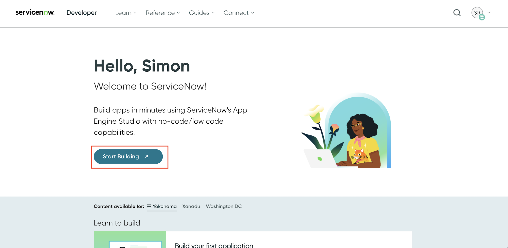

4. **Under "My instance", click Change User Role** and ensure that the User Role is set to Admin.

   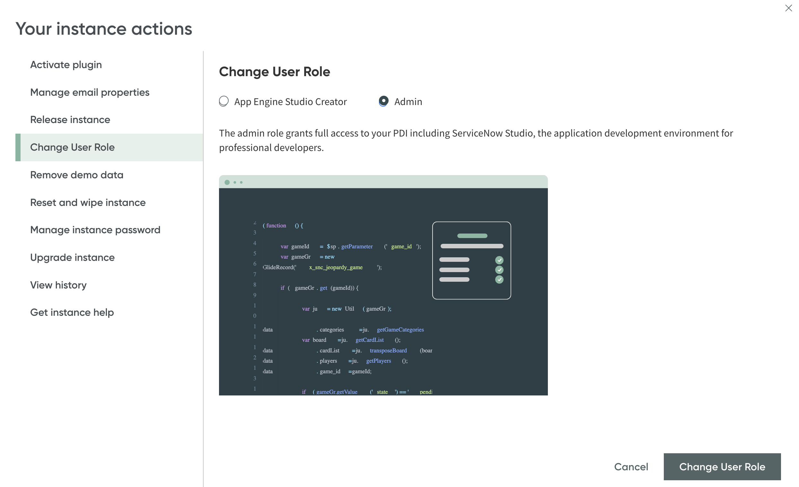

5. **Back on the landing page, click your profile icon** on the upper right. Under "My instance", click manage instance password.

   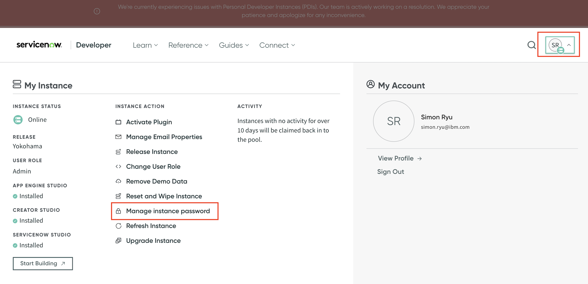

6. **Create an application connection** by using these credentials. Make sure to replace `SERVICENOW_INSTANCE_URL` and `SERVICENOW_PASSWORD` with your own credentials from the previous step. Remember to surround the password string with double quotes:

   ```bash
   orchestrate connections add -a service-now

   orchestrate connections configure -a service-now --env live --type team --kind basic --url SERVICENOW_INSTANCE_URL

   orchestrate connections set-credentials -a service-now --env live -u admin -p SERVICENOW_PASSWORD
   ```

7. **Import the tools for your agent:**

   ```bash
   orchestrate tools import -k python -f ./tools/customer_care/get_my_claims.py

   orchestrate tools import -k python -f ./tools/customer_care/get_healthcare_benefits.py

   orchestrate tools import -k python -f ./tools/customer_care/search_healthcare_providers.py

   orchestrate tools import -k python -f ./tools/servicenow/create_service_now_incident.py -r ./tools/requirements.txt -a service-now

   orchestrate tools import -k python -f ./tools/servicenow/get_my_service_now_incidents.py -r ./tools/requirements.txt -a service-now

   orchestrate tools import -k python -f ./tools/servicenow/get_service_now_incident_by_number.py -r ./tools/requirements.txt -a service-now
   ```

8. **Import each agent created previously:**

   ```bash
   orchestrate agents import -f ./agents/service_now_agent.yaml

   orchestrate agents import -f ./agents/customer_care_agent.yaml
   ```

## Section 5: Agent's profile

This section shows how to define the name and description of your agent. This gives your agent a clear purpose and helps guide how it interacts with users.

1. **From the IBM watsonx Orchestrate chat page, click "Manage agents".**

   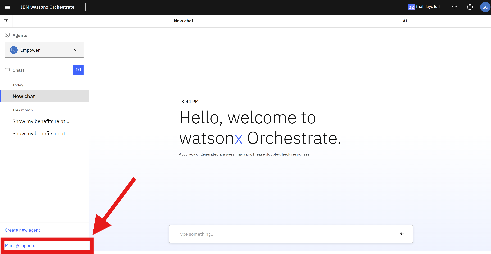

2. **Click "Create agent".**

   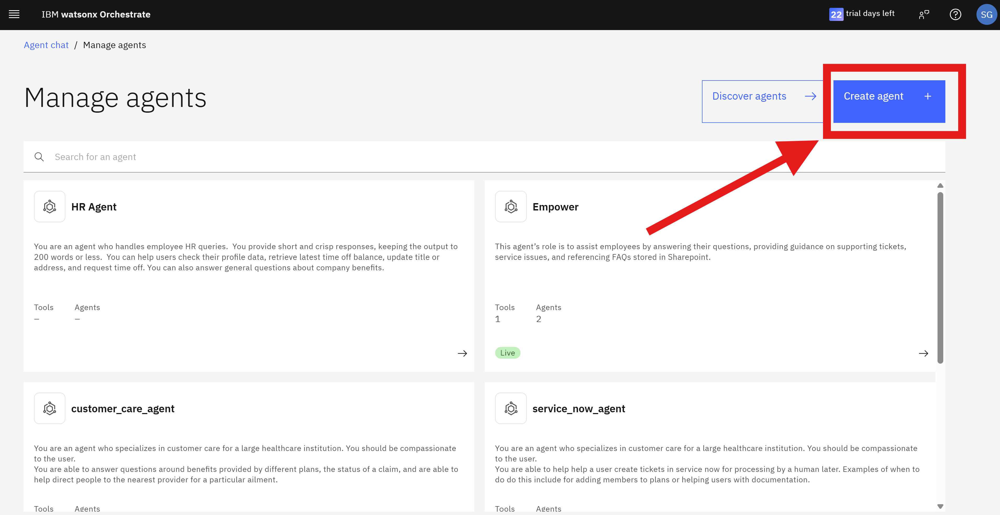

3. **Choose "Start from Scratch".**

4. **In the Name field, insert "Empower"** and in the "Purpose", insert a text as you prefer to describe the agent. 
   
   **Suggestion:** "This agent's role is to assist employees by answering their questions, providing guidance on supporting tickets, service issues, and referencing FAQs stored in Sharepoint".

5. **Click "Finish" to complete.**

   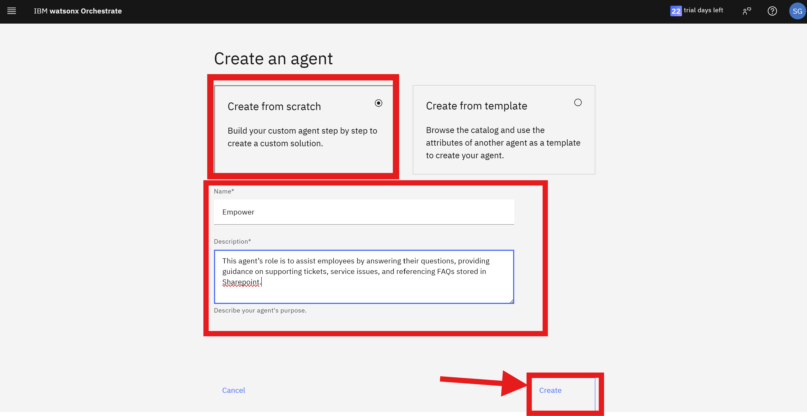

You finished working on the profile.

## Section 6: Agent's tasks

This section guides you through how to equip your agent with tools, and how to add other agents to collaborate in accomplishing tasks.

### To add tools:

1. **From the Empower agent management screen, go to the "Toolset" section.**

   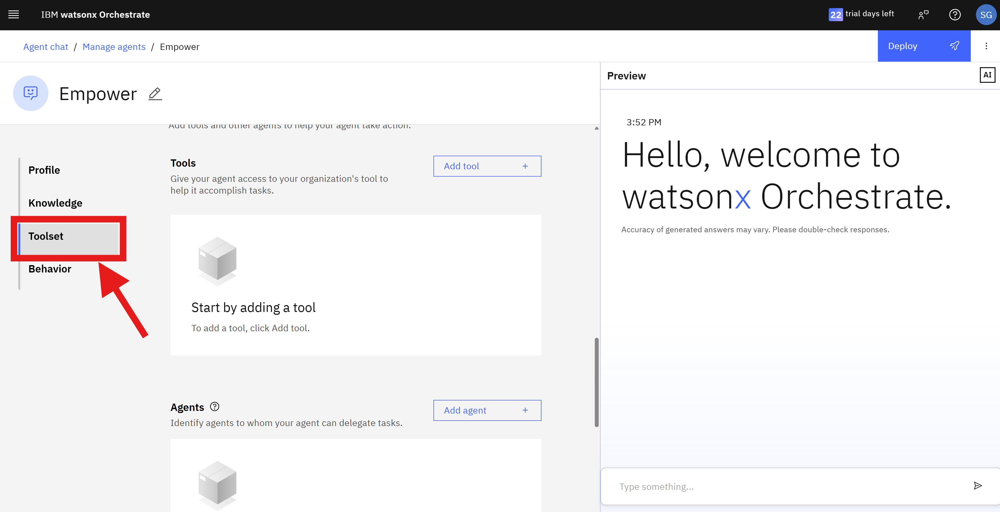

2. **In Tools, click the drop-down list "Add tool"**, and select "Add from local instance".

   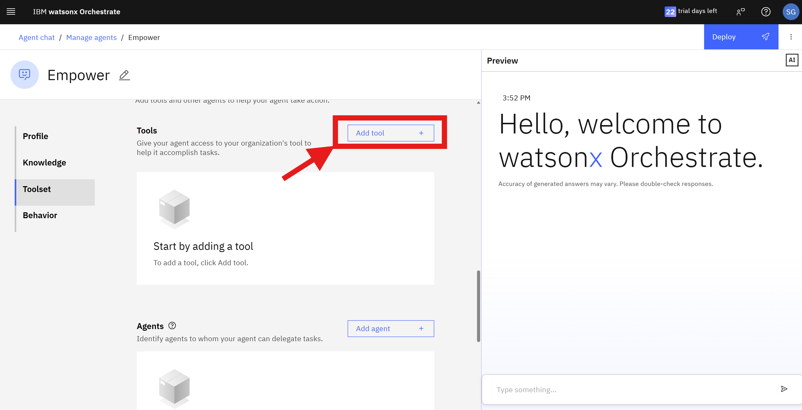

   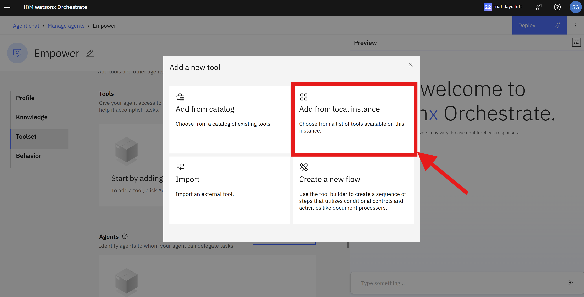

3. **Search for example "get_healthcare_benefits"**, and select it by clicking in the plus icon. Close the tools pop-up.

   > **Please note:** In this case since these tools are used within the customer_care_agent and service_now_agent, you do not need to explicitly add the tools. This is just to show how you could add the tools in general.

   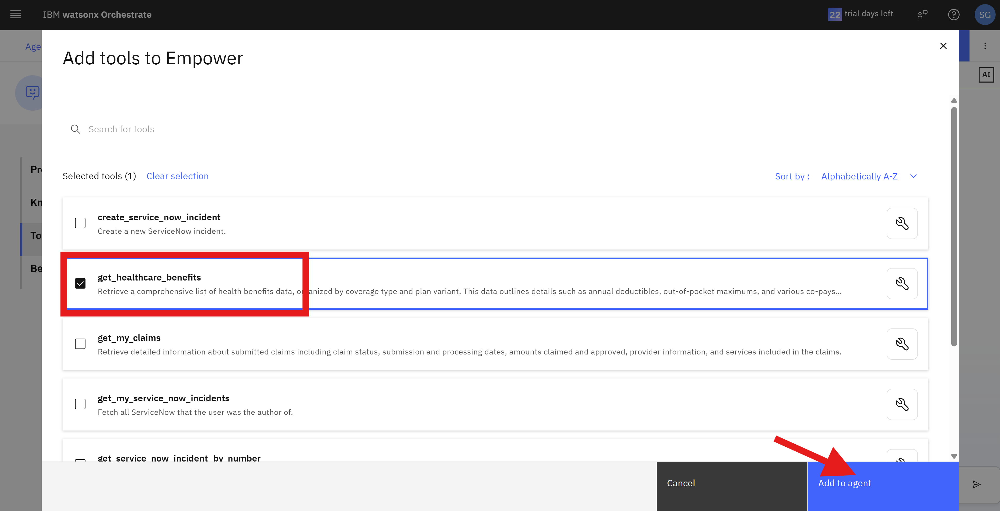

### To add agents:

1. **In "Agents", add the agent that collaborates with your agent** on running tasks. Click "Add agents +".

   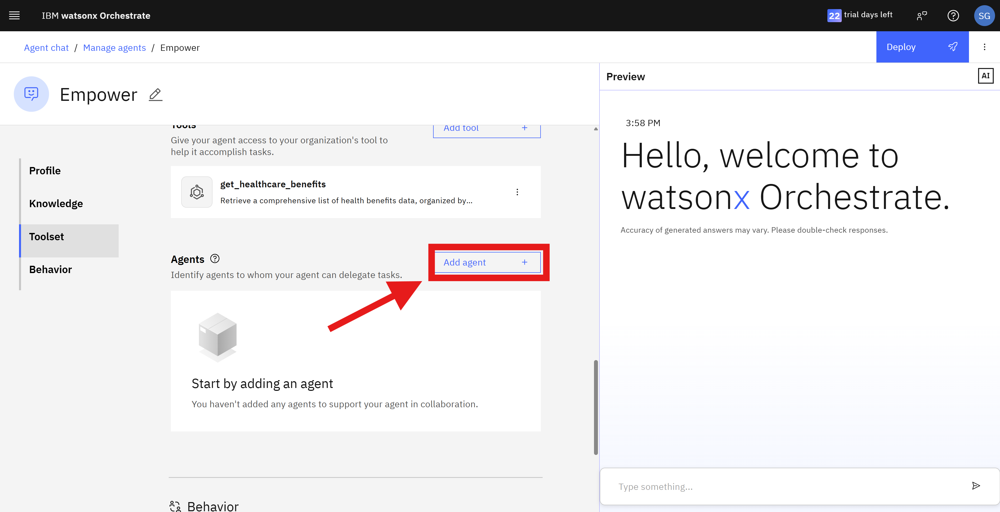

2. **Select "Add from local instance".**

   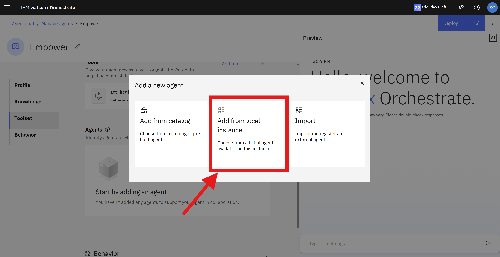

3. **Select "service_now_agent and customer_care_agent"** by clicking in the plus icon and close the collaborator agents pop-up.

   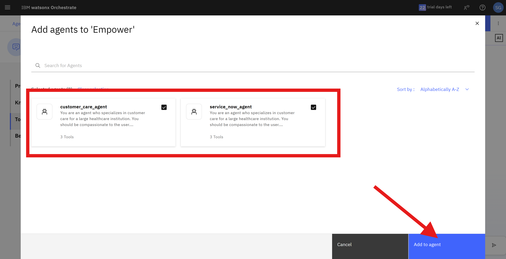

4. **Add the following under the Behavior section:** 
   
   "You need to use the tools and agents available to you to answer user's questions. If the user has any questions about healthcare benefits you can use the customer_care_agent, and if the user wants to use servicenow service to create a ticket you can use servicenow agent."

   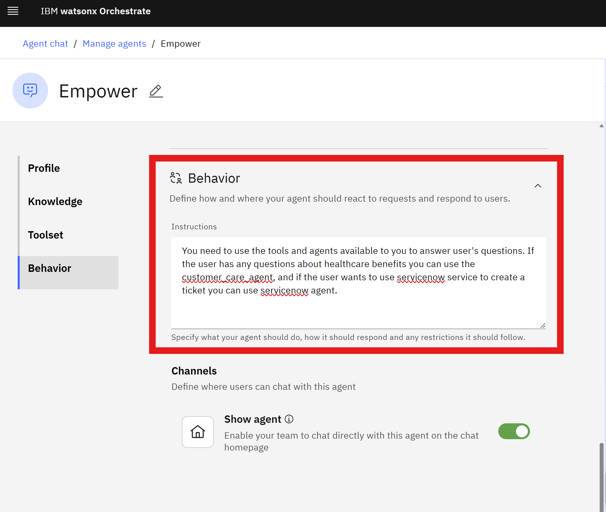

## Section 7: Chat preview

This section shows how you can see your agent in action before deploying, allowing you to quickly validate that everything works as expected.

1. **From the Empower agent management screen, type in the chat bar** "Show my benefits related to mental health", and press **Enter**.

2. **Wait for the chat response.** You can check how your response was generated by clicking "How did I get this response".

   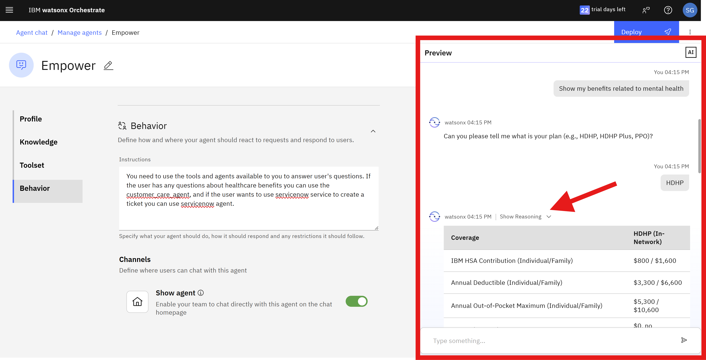

   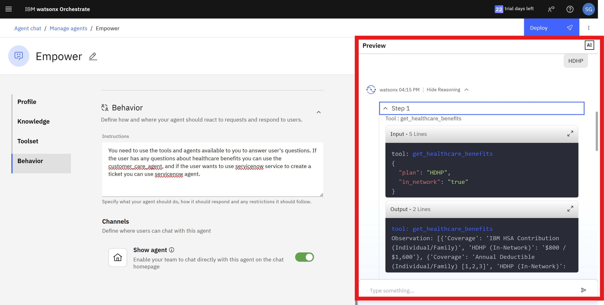

You finished previewing your chat.

### You can try other questions to test the other agents/tools, such as:

- "Can you get all my claims?"
- "I'm having difficulty generating benefits documents. Can you create a ServiceNow incident?"
- "Show my Service Now Incidents."

## Section 8: Deploying Empower agent

This final section guides you to deploy your agent and make it available in the IBM watsonx Orchestrate chat.

1. **Click "Deploy".**

   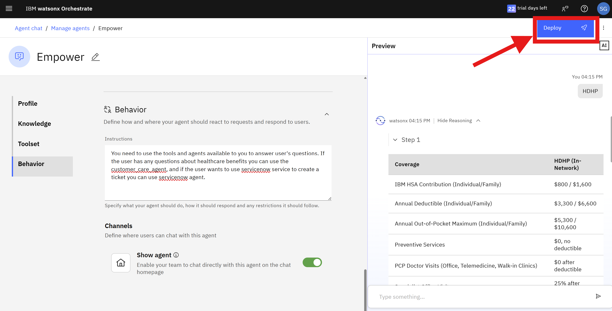

2. **Click "Home" or "IBM watsonx Orchestrate"** to return for the chat page.

   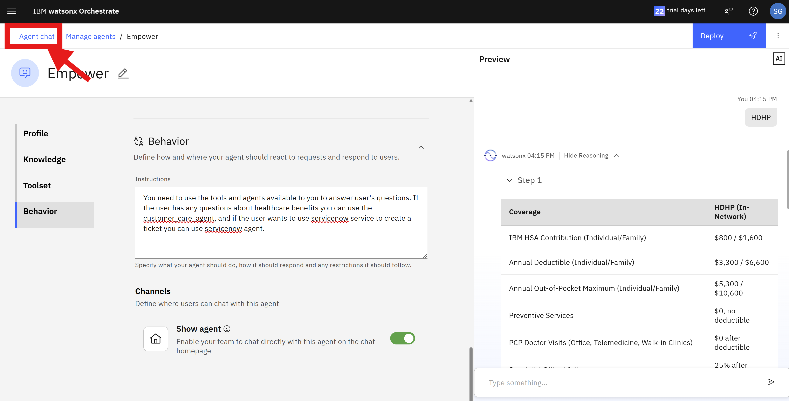

3. **In the "Agents" list, select the Empower agent**, and start by using it directly from the watsonx Orchestrate chat page.

   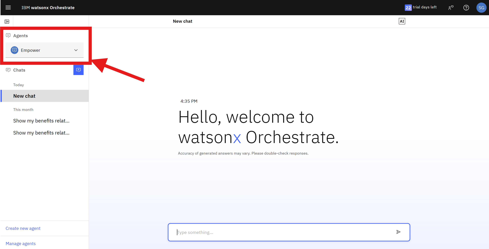

### Ask for tasks like:

- Show my benefits related to mental health.
- I want to view my submitted claims.

You can ask about service now issues, as your agent has the Service now agent collaborating on running tasks. Such as:

- I am having difficulty adding dependents to my plan, can you create a ticket?
- View my tickets

**Congratulations!** You now have completed the process of creating and deploying your Empower agent!
