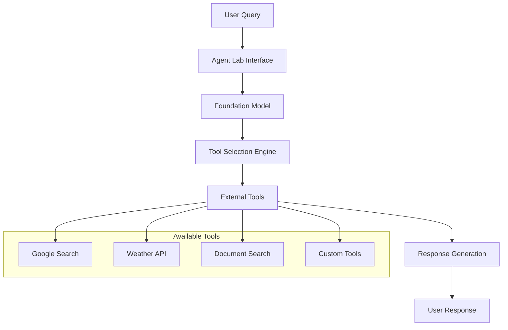
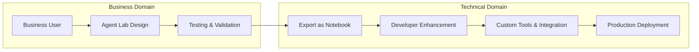

# Lab 1: Building AI Agents with watsonx.ai Agent Lab

## Overview

In this lab, you'll learn how to build, test, and deploy a vacation planning agent while exploring the collaboration opportunities between business users and developers.

### Learning Objectives
By the end of this lab, you will:
- Build a functional vacation planning agent with multiple tools
- Deploy your agent using 1-click deployment
- Explore the developer collaboration workflow through deployment notebooks
- Collect essential deployment credentials for downstream integrations

---

## Table of Contents


1. [Agent Lab Platform Overview](#agent-lab-platform-overview)
   - [What is Agent Lab?](#what-is-agent-lab)
   - [Key Value Propositions](#key-value-propositions)
   - [Architecture Overview](#architecture-overview)
2. [Building Your First Agent](#building-your-first-agent)
   - [Step 1: Project Setup and Access](#step-1-project-setup-and-access)
   - [Step 2: Build Agent Profile](#step-2-build-agent-profile)
   - [Step 3: Testing and Validation](#step-3-testing-and-validation)
   - [Step 4: Initiate Deployment Process](#step-4-initiate-deployment-process)
   - [Step 5: Deployment Space Configuration](#step-5-deployment-space-configuration)
   - [Step 6: Final Deployment](#step-6-final-deployment)
   - [Step 5: Collecting Deployment Credentials](#step-5-collecting-deployment-credentials)
3. [Lab Completion](#-lab-completion)
4. [[Optional] Developer Collaboration Workflow](#developer-collaboration-workflow)
   - [The Business-Developer Bridge](#the-business-developer-bridge)
   - [Workflow Overview](#workflow-overview)
   - [Save Options: Agent vs. Deployment Notebook](#save-options-agent-vs-deployment-notebook)
   - [Developer Enhancement Opportunities](#developer-enhancement-opportunities)
   - [Collaboration Best Practices](#collaboration-best-practices)


---

## Agent Lab Platform Overview

### What is Agent Lab?

**watsonx.ai Agent Lab** is a low-code platform that democratizes AI agent development, enabling both business users and technical teams to create sophisticated AI agents without extensive coding knowledge. The platform bridges the gap between business requirements and technical implementation.

### Key Value Propositions

#### **Low-Code Agent Builder**
- **Business Impact**: Enables domain experts to directly build AI solutions
- **Technical Value**: Reduces development time from weeks to hours
- **Collaboration**: Creates a common platform for business and technical teams

#### **One-Click Deployment**
- **Scalability**: Instant deployment as enterprise-ready AI services
- **Time-to-Value**: Deploy and test agents in production within minutes
- **Integration Ready**: Generate REST APIs for seamless system integration

#### **Developer Collaboration Bridge**
- **Notebook Export**: Business-created agents export as customizable Jupyter notebooks
- **Code Extension**: Developers can enhance agents with custom tools and integrations
- **Version Control**: Seamless handoff between business design and technical implementation

### Architecture Overview



For the latest platform capabilities and updates, reference the [official documentation](https://dataplatform.cloud.ibm.com/docs/content/wsj/analyze-data/fm-agent-lab.html?context=wx&pos=2).

---

## Building Your First Agent

### Step 1: Project Setup and Access

**Initial Setup**
1. Navigate to your watsonx.ai project dashboard
2. Access the **Assets** tab
3. Select **New Asset**


4. Choose **"Build an AI agent to automate tasks"** from the asset catalog


5. When opening the Agent Lab for the first time, you will need to associate it with an ai runtime service. Click on **"Associate service"**.


6. Select the available runtime from the dropdown
7. Click **"Associate"** to confirm


### Step 2: Build Agent Profile

The Agent Lab interface is divided into two main sections:

- **Left Panel (Build)**: Agent configuration and setup
- **Right Panel (Agent Preview)**: Real-time testing and validation

When choosing the LLM for the agent, you can:
- Choose your preferred foundation model
- Adjust model parameters (temperature, max tokens, etc.)
- Consider your use case requirements (creativity vs. precision)


1. Click **"Setup"** to define the name of the agent and the agent's purpose:
- **Agent Name**: Travel Concierge Assistant
- **Description**: An intelligent vacation planning assistant that helps users create detailed, budget-conscious travel itineraries

2. Click **"Configure"**:
You can configure the agent by selecting the Framework and the Architecture. Currently LangGrpah is the only Framework available and ReAct is the only Architecture available. More frameworks and architectures will be added to the Agent Lab in future releases.

Agent instructions are equivalent to prompt engineering for LLMs. Well-crafted instructions directly impact agent performance, tool selection accuracy, and response quality.

<p align="center">

</p>

3. Copy and paste the following instructions under **"Instructions"**:

```markdown
You are a professional vacation planning assistant specializing in creating detailed, budget-conscious travel itineraries.

**Primary Responsibilities:**
- Create comprehensive day-by-day vacation plans within specified budgets
- Provide real-time weather information for travel destinations
- Source current pricing and availability for travel services

**Tool Usage Guidelines:**

**Google Search Tool - Use for:**
- Flight options and pricing research
- Car rental service availability and rates
- Local dining establishments and menu reviews
- Activity bookings (tours, attractions, experiences)
- Accommodation recommendations and pricing
- Local grocery stores and convenience services

**Weather Tool - Use for:**
- Current weather conditions at destinations
- Multi-day weather forecasts for trip planning
- Seasonal weather patterns and recommendations

**Response Requirements:**
- Always respect budget constraints provided by users
- Provide specific, actionable recommendations with current pricing
- Include alternative options when primary choices may be unavailable
- Cite sources for pricing and availability information
```

4. Click on **"Tools"**. Select both **Google Search** and **Weather** tools to enable comprehensive travel planning capabilities.


---

### Step 3: Testing and Validation

#### Test Case 1: Comprehensive Travel Planning

**Test Query:**
```
Give me a detailed 5-day vacation plan to San Francisco, CA with a budget limit of $5000.
```

**Expected Behavior:**
- Agent should use Google Search to find current pricing
- Provide day-by-day itinerary breakdown
- Include accommodation, dining, transportation, and activities
- Respect the $5000 budget constraint


**Analyzing Agent Behavior:**
Click **"How did I get this answer?"** to examine:
- Which tools were selected and why
- Search queries executed
- Information synthesis process

<p align="center">

</p>

#### Test Case 2: Weather-Specific Queries

**Test Query:**
```
How is the weather in SF from March 5 to March 10?
```

**Expected Behavior:**
- Agent should automatically select the Weather tool
- Provide detailed forecast information
- Include travel recommendations based on weather conditions

<p align="center">

</p>

---

### Step 4: Initiate Deployment Process

Once satisfied with your agent's performance, deploy it as an enterprise-ready AI service:

1. Click the **"Deploy"** icon in the top-right corner
2. This opens the deployment configuration interface


3. **Critical Step**: Generate and securely store your API key for future integrations.


**⚠️ Security Best Practices:**
- Download and store the API key immediately
- API keys cannot be retrieved after initial creation
- Use secure credential management systems in production

<p align="center">

</p>

4. After saving your API key, return to the deployment page and click **"Reload"** to refresh the API key status.


### 🛠️ Troubleshooting: API Key Issues

If you encounter API key creation issues:

1. **Manual API Key Generation:**
   - Navigate to [IBM Cloud Console](https://cloud.ibm.com/)
   - Go to **Manage → Access (IAM)**
   - Create a new API key and download it

2. **Update watsonx.ai Profile:**
   - Open your watsonx.ai profile
   - Navigate to **User API Key**
   - Click **"Rotate"** to update to the latest key

### Step 5: Deployment Space Configuration

1. Create a dedicated deployment space for your agent:


**Configuration Parameters:**
- **Space Name**: `travel-concierge-prod`
- **Deployment Stage**: Production
- **Runtime Service**: Select from dropdown menu

### Step 6: Final Deployment

After creating your deployment space:

1. **Reload** the deployment space in the interface
2. Click **"Deploy"** to initiate the deployment process


**Deployment Timeline:**
- Initial deployment: 2-3 minutes
- Status will change from "Initializing" to "Deployed"


### 🛠️ Troubleshooting: Deployment Failures

Common deployment issues and solutions:

1. **API Key Related Failures:**
   - Generate a fresh API key in IBM Cloud
   - Update your watsonx.ai profile
   - Retry deployment

2. **Runtime Service Issues:**
   - Verify runtime service availability
   - Check service quotas and limits
   - Contact support if issues persist

### Step 5: Collecting Deployment Credentials

**Essential Information for Integration:**

Click on your deployed agent name to access the deployment details:


## Lab Completion

### Congratulations! 

You have successfully completed the Lab! See below for how Agent Lab allows collaborative workflow of business and development teams.

## Developer Collaboration Workflow

### The Business-Developer Bridge

**Agent Lab's Unique Value Proposition**: Seamless collaboration between business domain experts and technical developers.

### Workflow Overview



### Save Options: Agent vs. Deployment Notebook

When saving your work in Agent Lab, you have two strategic options:


#### Option 1: Save as Agent
- **Use Case**: Continue business user iteration
- **Benefits**: Maintain Agent Lab interface for further modifications
- **Ideal For**: Ongoing business user refinement and testing

#### Option 2: Save as Deployment Notebook
- **Use Case**: Hand off to development team
- **Benefits**: Provides complete, customizable Jupyter notebook
- **Ideal For**: Developer enhancement and custom integration

### Developer Enhancement Opportunities

**The deployment notebook provides developers with:**

1. **Complete Agent Code**: Full implementation with all configurations
2. **Customization Points**: Clear areas for adding custom tools and logic
3. **Integration Templates**: Pre-built API integration patterns
4. **Testing Framework**: Built-in testing and validation capabilities

**Common Developer Enhancements:**
- **Custom Tool Integration**: Connect to enterprise APIs and databases
- **Advanced Error Handling**: Implement sophisticated fallback mechanisms
- **Performance Optimization**: Add caching and response optimization
- **Security Enhancements**: Implement enterprise-grade security controls
- **Monitoring and Logging**: Add comprehensive observability features

### Collaboration Best Practices

1. **Clear Handoff Documentation**: Business users should document use cases and expected behaviors
2. **Version Control**: Use Git for managing notebook versions and modifications
3. **Testing Continuity**: Maintain the same test cases across business and technical implementations
4. **Feedback Loops**: Establish regular check-ins between business and technical teams


