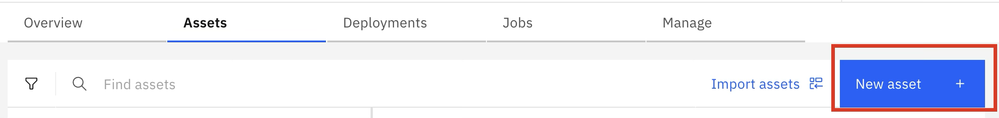
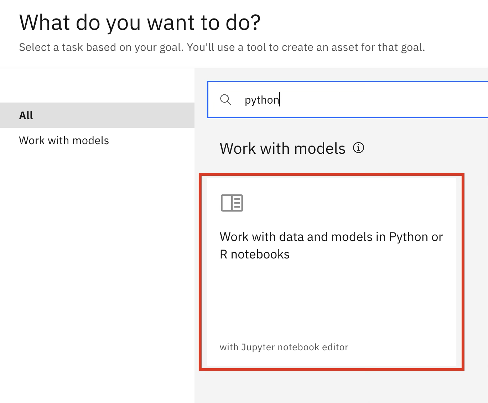
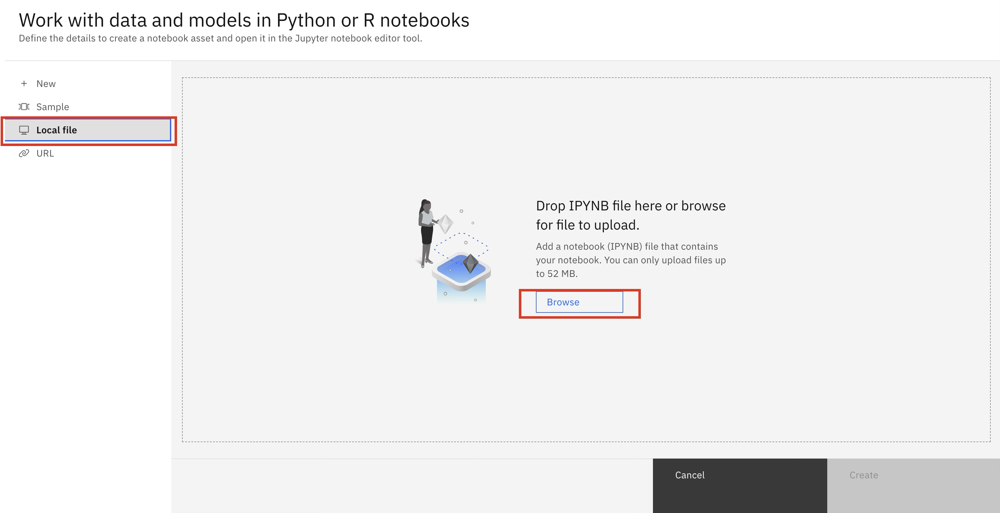
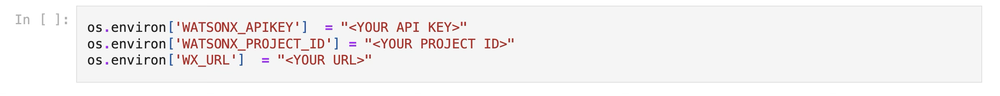
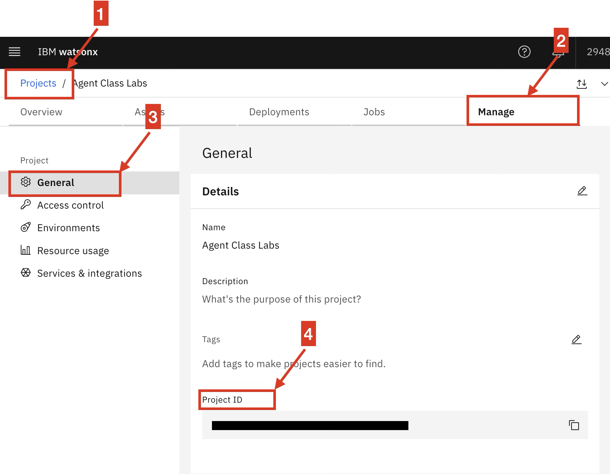
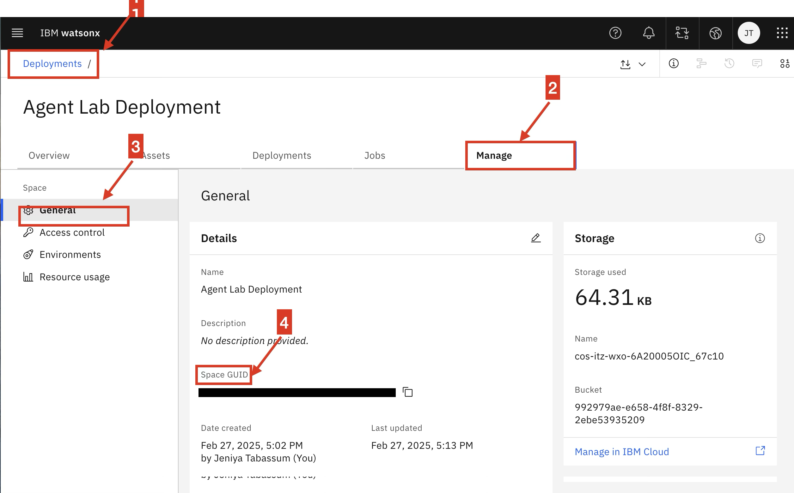
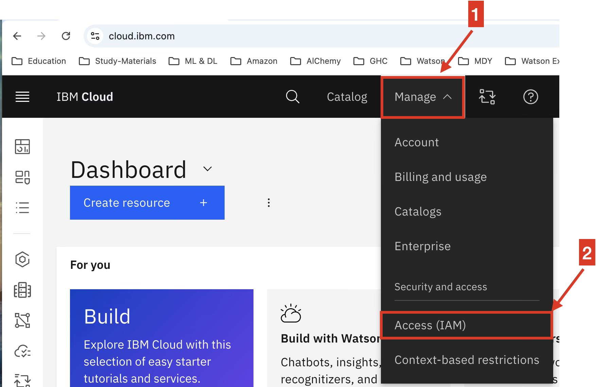
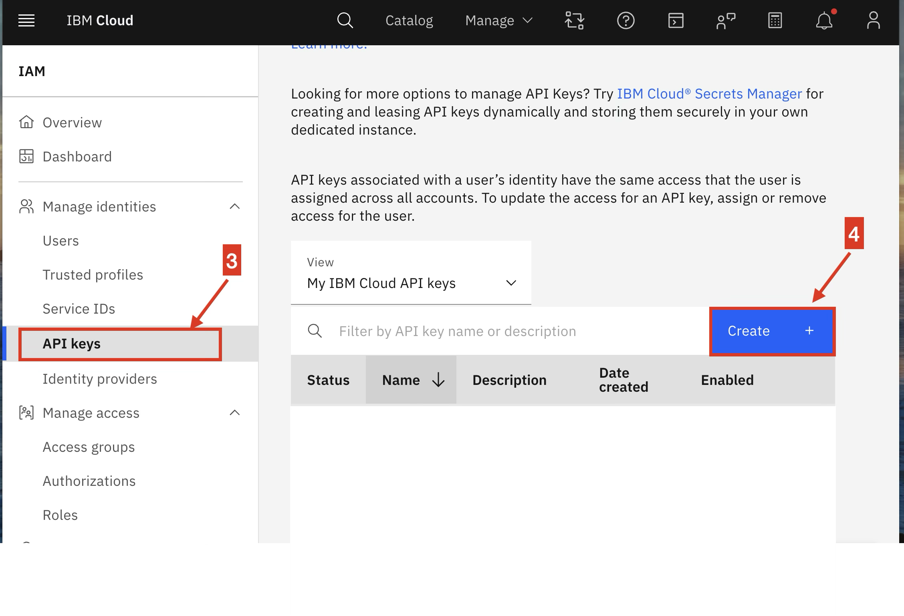
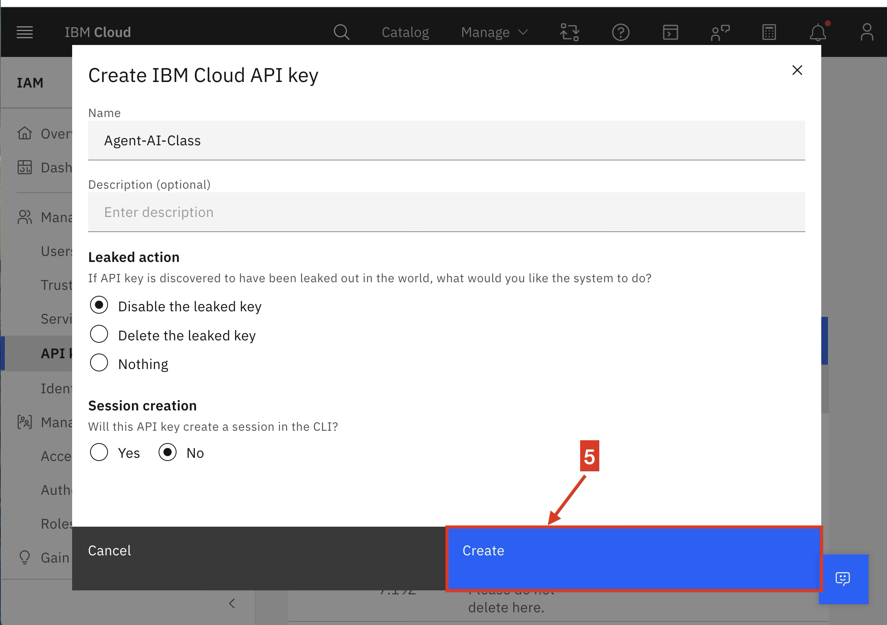
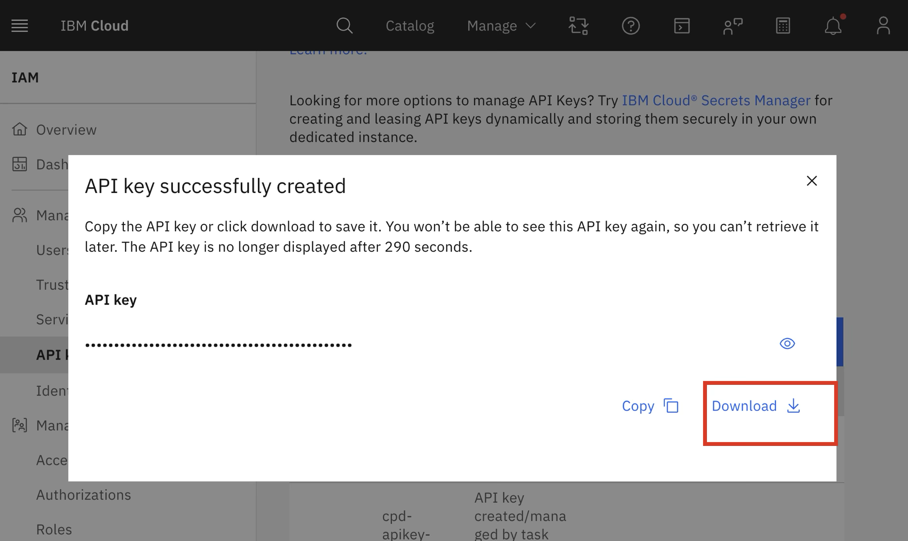

# Frequently Asked Questions (FAQ)

---

This document provides step-by-step guidance on retrieving the essential credentials and configurations needed for using IBM Watsonx AI services.

## Table of Contents

1. [How to Load a Notebook](#how-to-load-a-notebook)
2. [How to Obtain the Project ID](#how-to-obtain-the-project-id)
3. [How to Obtain the Deployment Space ID](#how-to-obtain-the-deployment-space-id)
4. [How to Obtain the API Key](#how-to-obtain-the-api-key)
5. [How to Obtain the Watsonx URL](#how-to-obtain-the-watsonx-url)

## How to Load a Notebook

To load the Loyalty Specialist Agent notebook into your project, follow these steps:

 

## How to Obtain the Project ID

To locate your **Project ID**, follow the steps below. You can also refer to the image for visual guidance:

## How to Obtain the Deployment Space ID

To retrieve your **Deployment Space ID**, follow the steps illustrated below:

## How to Obtain the API Key

Follow the steps below to obtain your **API Key**. Visual references are provided for your convenience:

## How to Obtain the Watsonx URL

For detailed instructions on obtaining your **Watsonx URL**, please refer to the official IBM documentation: [IBM Watsonx Authentication Setup](https://ibm.github.io/watsonx-ai-python-sdk/setup_cloud.html#authentication)

