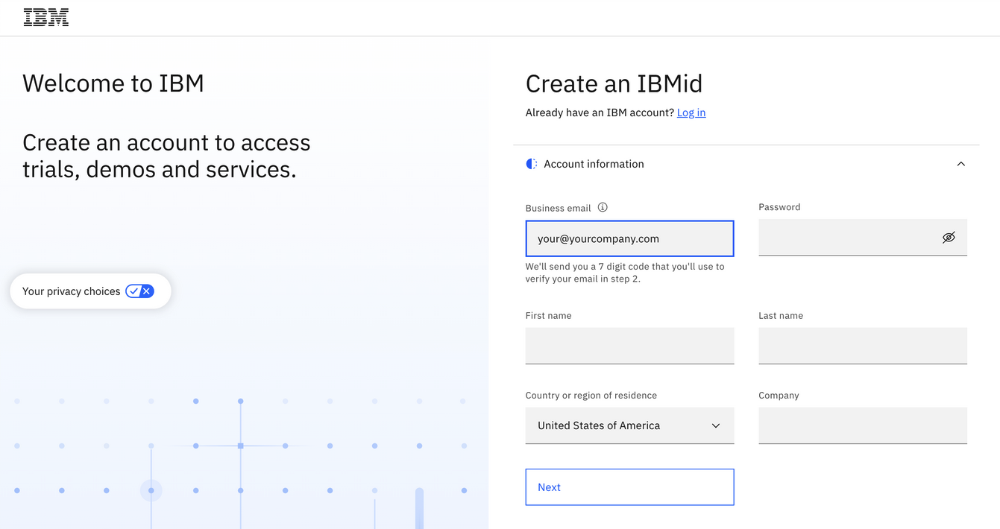
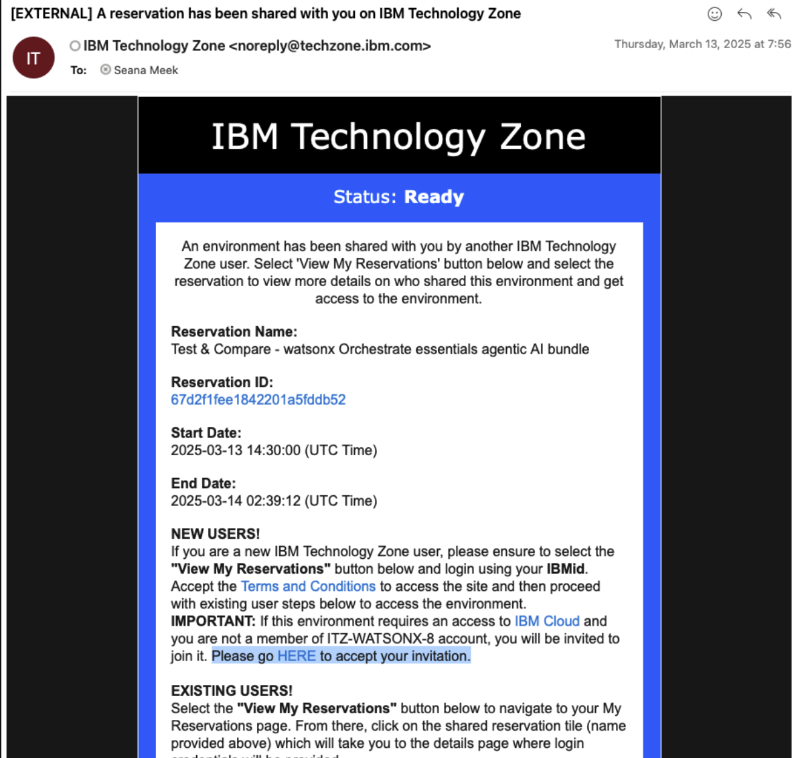
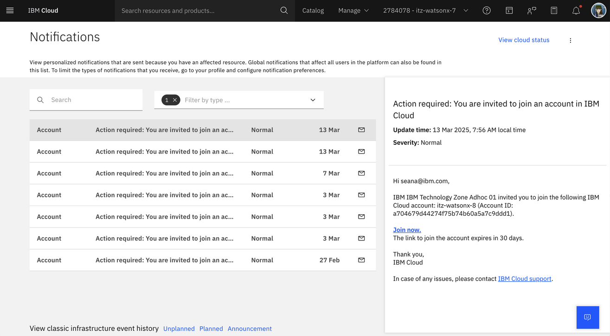
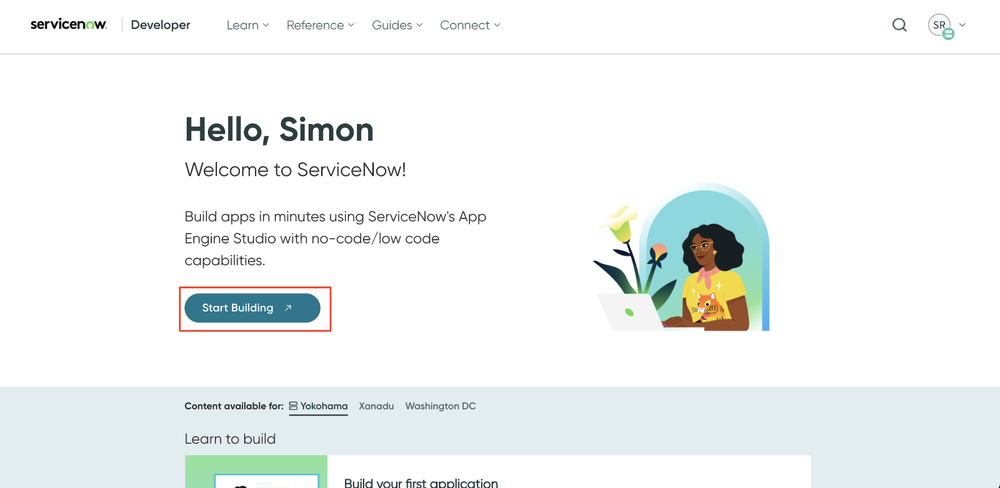
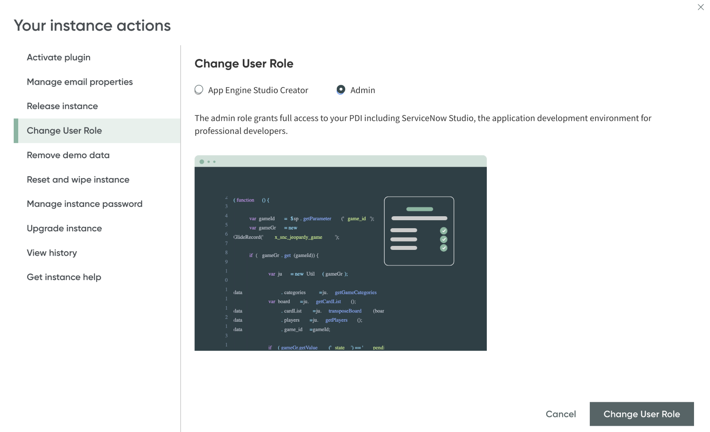
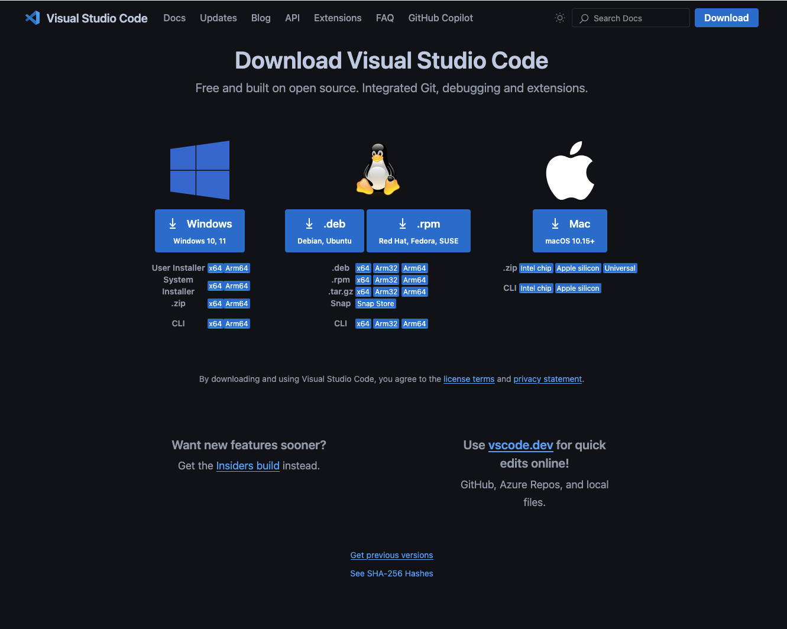

Environment Preparation before Bootcamp

1.  Create your IBMid

You MUST have an IBMID BEFORE we invite you to the workshop
environments.

1.  Start by accessing the IBMid Registration Page
    [<u>https://www.ibm.com/account/reg/signup?formid=urx-19776&</u>](https://www.ibm.com/account/reg/signup?formid=urx-19776&)

2.  Enter the required information in the fields provided, such as Email
    address, name, company, and country.

IMPORTANT: Your email address becomes your IBMid, which you will use to
access the bootcamp environment!

1.  Click the Next button. You will receive an email containing a
    one-time verification code.

2.  In the Verification field, enter the code that is provided in the
    email.

3.  Click Create account.

4.  An email will be sent indicating that your IBMid account creation
    was successful, and your account is now activated.

<!-- -->

1.  Access Class Environment

After you created the IBMid account, **please let us know and we will
invite you to the environment**. Otherwise, you won’t receive the email
mentioned below.

1.  When you are invited to the class environment, you'll receive an
    email. This message is from IBM Technology Zone
    noreply@techzone.ibm.com inviting you to join the account where your
    class environment is located.

2.  In the email, look for the link in the sentence "Please go HERE to
    accept your invitation." (Highlighted in the screenshot below.)

1.  Option: If you miss the email or don't receive it for any reason!
    You can find the invitation on your IBM Cloud account:
    <https://cloud.ibm.com/notifications?type=account>

2.  Please select the Join Now link.

1.  Install the ADK

You will need to install the IBM watsonx Orchestrate Agent Development
Kit (ADK) for the hands-on lab of the ADK. It is packaged as a Python
library and command line tool that allows builders to configure agents
that run on the IBM Watsonx Orchestrate platform. 

Make sure you have Python and pip installed:

- **Python**: The ADK requires at least Python 3.11, and the latest
  compatible version is Python 3.13. For more information, see
  [**Python**](https://www.python.org/downloads/).

- **Pip**: Pip is Python’s package manager. In some operating systems,
  it’s included with Python’s installation. For more information, see
  [**Pip**](https://pip.pypa.io/en/stable/installation/).

Then on your local computer open your terminal/ Command prompt and run
the following commands: 

1.  Install the ADK with pip:  

pip install ibm-watsonx-orchestrate 

 

1.  Test the installation: 

orchestrate --version 

 

After installation, you can start using the ADK and its CLI. For more
information on available commands and arguments, use the --help argument
at the end of a command. For example: orchestrate --help. 

1.  Sign up for a ServiceNow Account

For the ADK Lab, you will also need to sign up for a ServiceNow Account
to serve as a backend for the custom tools.

1.  Signup for a Service Now account
    at https://developer.servicenow.com/dev.do. 

<!-- -->

1.  Validate your email address (check email). 

2.  On the landing page, click start building. This allocates a new
    instance of ServiceNow for you. 

>  style="width:6.5in;height:3.17569in"
> alt="A screenshot of a computer AI-generated content may be incorrect." /> 

1.  Under “My instance”, click Change User Role and ensure that the User
    Role is set to Admin. 

>  style="width:6.5in;height:3.96042in"
> alt="A screenshot of a computer program AI-generated content may be incorrect." />

1.  Download and install VSCode

For this lab, you'll need an IDE to modify some configuration files.

We recommend downloading and installing **VS Code** using the following
link:

<https://code.visualstudio.com/download>

Alternatively, feel free to use any IDE you're comfortable with.

That's it! Once you've completed the steps above, you'll be fully
prepared for the workshop. If you run into any issues, don't hesitate to
reach out.

We’re excited to have you join us — see you at the bootcamp!
